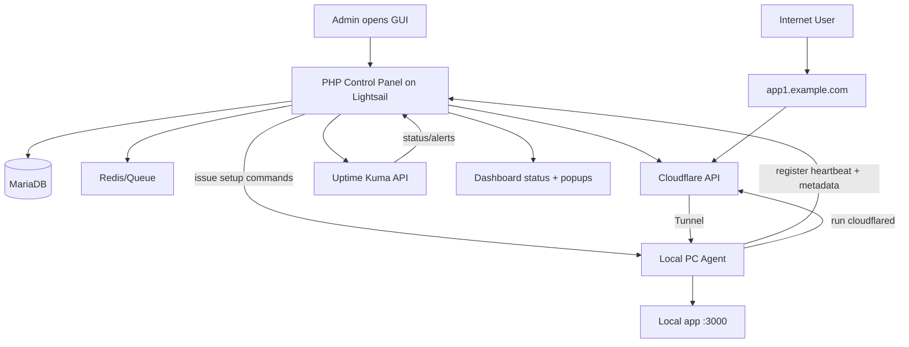
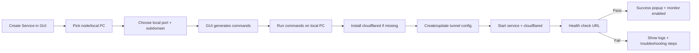

# Self-Hosted Internal App Publishing Platform (Cloudflare Tunnel + PHP GUI + Uptime Kuma)

This guide explains how to build your **own internal platform** (for yourself/your org) that lets you expose local apps to the internet via domains, with a password-protected GUI and monitoring.

---

## 1) Short Answer to Your Main Question

### Can you host "Cloudflare Tunnel" on your own VPS (like AWS Lightsail)?

**Yes and no:**

- ✅ You can run `cloudflared` on your own VPS (Lightsail) and on local machines.
- ✅ You can build your own GUI/control panel that manages tunnels/config and automation.
- ❌ You **cannot self-host Cloudflare’s tunnel backbone** itself (that part is Cloudflare-managed SaaS).

So your practical design is:

1. Keep Cloudflare as tunnel/data-plane provider.
2. Self-host your own control-plane GUI + automation on Lightsail.
3. Use agents (or scripts) on local PCs to connect local services into Cloudflare tunnels.

That exactly matches your use case: **internal tools + personal projects for your own org**, not public SaaS.

---

## 2) High-Level Features You Asked For

- Password-protected admin GUI (PHP).
- Add/edit/enable/disable published services.
- Domain/subdomain mapping to local services.
- Guided local setup steps + ready-to-copy commands.
- Success/failure status popup after validation.
- Uptime monitoring (Uptime Kuma-like) + alerts.
- Dockerized deployment on a small VPS (2GB RAM / 2 vCPU).

---

## 3) Recommended Architecture (Production-Friendly for 2GB Lightsail)

- **AWS Lightsail VPS** (Ubuntu) hosts control-plane only:
  - PHP GUI app (`php-fpm` + `nginx`)
  - Database (`mariadb`)
  - Queue/cache (`redis`) optional but recommended
  - Background worker / scheduler
  - Uptime Kuma
  - Reverse proxy (Traefik or Nginx) for TLS routing
- **Cloudflare**:
  - DNS + Zero Trust + Tunnel APIs
- **Local PC / servers**:
  - `cloudflared` + lightweight service agent script
  - Registers service and keeps tunnel config updated

> Why this split? You avoid hairpin traffic through VPS and keep each app near its source machine.

---

## 4) End-to-End System Flow (Mermaid)



---

## 5) Service Host Setup Flow (Mermaid)



---

## 6) Suggested Repository / Project Structure

```text
platform/
├─ docker-compose.yml
├─ .env
├─ README.md
├─ reverse-proxy/
│  └─ traefik.yml
├─ app/                          # PHP control panel
│  ├─ public/
│  ├─ src/
│  │  ├─ Controller/
│  │  ├─ Service/
│  │  ├─ Cloudflare/
│  │  ├─ Agent/
│  │  └─ Monitoring/
│  ├─ templates/
│  ├─ migrations/
│  └─ worker/
├─ agent/
│  ├─ install.sh
│  ├─ register.sh
│  ├─ service-template.yml
│  └─ systemd/
│     ├─ local-agent.service
│     └─ cloudflared@.service
├─ scripts/
│  ├─ bootstrap-server.sh
│  ├─ backup-db.sh
│  └─ restore-db.sh
└─ monitoring/
   └─ kuma/
      └─ data/
```

---

## 7) Core Components and Responsibilities

### 7.1 PHP Admin GUI

Key modules:

- **Auth**: admin login, session timeout, 2FA (optional).
- **Services**: CRUD for apps (name, domain, node, local port, protocol).
- **Nodes**: local machines/agents inventory.
- **Provisioning**: generate commands and API calls.
- **Deploy logs**: store stdout/stderr from setup tasks.
- **Monitoring**: pull and show Uptime Kuma status.

### 7.2 Cloudflare Integration

Use Cloudflare API token with limited scopes:

- Zone:DNS:Edit
- Account:Cloudflare Tunnel:Edit
- Account:Access (only if using Access policies)

Actions from GUI:

1. Create/ensure tunnel.
2. Map DNS `subdomain.example.com` to tunnel route.
3. Update tunnel ingress config.
4. Rotate tunnel token/certs when needed.

### 7.3 Local Agent

The GUI should provide copy-paste commands to run on target machine:

- Install `cloudflared`.
- Download signed config from control-plane.
- Create systemd services.
- Start and enable services.
- Report status back to GUI API.

### 7.4 Uptime Kuma

- Auto-create monitors when a service is enabled.
- Tag by environment/team/node.
- Show state in GUI dashboard.
- Optional alerting via Telegram/Slack/Email/Webhook.

---

## 8) Minimal Docker Compose (Control Plane)

```yaml
version: "3.9"
services:
  web:
    image: nginx:alpine
    ports:
      - "80:80"
      - "443:443"
    volumes:
      - ./app:/var/www/html
      - ./reverse-proxy/nginx.conf:/etc/nginx/conf.d/default.conf
    depends_on:
      - php

  php:
    image: php:8.3-fpm
    volumes:
      - ./app:/var/www/html
    environment:
      APP_ENV: production

  db:
    image: mariadb:11
    environment:
      MYSQL_DATABASE: controlpanel
      MYSQL_USER: cp_user
      MYSQL_PASSWORD: change_me
      MYSQL_ROOT_PASSWORD: root_change_me
    volumes:
      - db_data:/var/lib/mysql

  redis:
    image: redis:7-alpine

  kuma:
    image: louislam/uptime-kuma:1
    volumes:
      - kuma_data:/app/data
    ports:
      - "3001:3001"

volumes:
  db_data:
  kuma_data:
```

> On 2GB RAM, keep only essential services and tune memory limits. If needed, move DB to managed service.

---

## 9) Step-by-Step Deployment on AWS Lightsail

## 9.1 Provision VM

- Ubuntu 22.04 LTS
- 2GB RAM, 2 vCPU
- Static IP attached
- Open ports: 22, 80, 443

## 9.2 Base Setup

```bash
sudo apt update && sudo apt upgrade -y
sudo apt install -y docker.io docker-compose-plugin git curl ufw
sudo usermod -aG docker $USER
newgrp docker
```

## 9.3 Firewall

```bash
sudo ufw allow 22
sudo ufw allow 80
sudo ufw allow 443
sudo ufw enable
```

## 9.4 Clone and Configure

```bash
git clone <your-private-repo> platform
cd platform
cp .env.example .env
# fill DB creds, CF API token, app secret, domain
```

## 9.5 Start Stack

```bash
docker compose up -d
docker compose ps
```

## 9.6 Initialize App

```bash
docker compose exec php php artisan migrate --force
# or your php framework equivalent migration command
```

## 9.7 DNS

- Point `panel.example.com` → Lightsail public IP.
- In Cloudflare proxy mode (orange cloud), enforce HTTPS.

## 9.8 Optional Security Hardening

- Cloudflare Access in front of admin GUI.
- Fail2ban + SSH key-only login.
- Disable password auth in sshd.
- Daily DB backup + offsite sync.

---

## 10) Local Machine Onboarding (What GUI Should Generate)

Example generated flow shown to admin:

```bash
# 1) Install cloudflared
curl -fsSL https://pkg.cloudflare.com/cloudflare-main.gpg | sudo gpg --dearmor -o /usr/share/keyrings/cloudflare-main.gpg
echo 'deb [signed-by=/usr/share/keyrings/cloudflare-main.gpg] https://pkg.cloudflare.com/cloudflared stable main' | sudo tee /etc/apt/sources.list.d/cloudflared.list
sudo apt update && sudo apt install -y cloudflared

# 2) Write tunnel config provided by panel
sudo mkdir -p /etc/cloudflared
sudo tee /etc/cloudflared/<service>.yml >/dev/null <<'YAML'
tunnel: <tunnel-id>
credentials-file: /etc/cloudflared/<tunnel-id>.json
ingress:
  - hostname: app1.example.com
    service: http://127.0.0.1:3000
  - service: http_status:404
YAML

# 3) Start cloudflared as service
sudo cloudflared service install
sudo systemctl enable --now cloudflared

# 4) Verify local service + tunnel
curl -I http://127.0.0.1:3000
cloudflared tunnel list
```

GUI then performs:

- `/health` check on domain.
- If 200 OK → success popup + add Uptime Kuma monitor.
- If failed → show exact failure stage + logs.

---

## 11) Data Model (Practical Tables)

- `users` (admin users)
- `nodes` (local PCs/servers)
- `services` (service definitions)
- `deployments` (attempt history)
- `domain_routes` (subdomain to tunnel mapping)
- `monitors` (uptime monitor references)
- `audit_logs` (who changed what)
- `secrets` (encrypted tokens/credentials references)

---

## 12) Suggested GUI Pages

- Dashboard (up/down counts, recent incidents)
- Services list
- Add service wizard
- Nodes/agents list
- Deployment logs view
- Monitoring page (embedded/synced from Kuma)
- Settings (Cloudflare token, domain, alert channels)

---

## 13) Performance Guidance for 2GB RAM

- Use Alpine-based images where possible.
- Keep PHP opcache enabled.
- Limit concurrent workers.
- Set MariaDB conservative buffers.
- Place Uptime Kuma checks at sane intervals (e.g., 60s not 5s).
- Use swap (1–2 GB) to reduce OOM risk.

---

## 14) Security Checklist

- Store API tokens encrypted at rest.
- Principle of least privilege for Cloudflare token.
- Force HTTPS and HSTS.
- Add per-service auth using Cloudflare Access when needed.
- Sign agent registration tokens with expiry.
- Audit logs for all admin actions.
- Rotate credentials quarterly.

---

## 15) Operational Runbook

### If a service goes down

1. Check GUI deployment history.
2. Check local app process and port.
3. Check `cloudflared` service status on node.
4. Check Cloudflare tunnel health.
5. Restart only failed component.
6. Record incident notes in dashboard.

### Backup plan

- Daily DB dump.
- Weekly restore test on staging VM.
- Keep encrypted copy of `.env` and tunnel metadata.

---

## 16) What This Is / Is Not

### This is

- A private self-hosted **control panel** for your org.
- Built on top of Cloudflare’s tunnel infra.

### This is not

- A replacement for Cloudflare’s global tunnel network.
- A public multitenant SaaS (unless you build billing, tenant isolation, etc.).

---

## 17) Build Roadmap (Recommended Order)

1. Phase 1: manual service create + command generation.
2. Phase 2: local agent heartbeat + one-click onboarding.
3. Phase 3: auto monitor creation and alert routing.
4. Phase 4: RBAC, audit, backups, secret rotation.
5. Phase 5: templates (Node, Python, Dockerized app presets).

---

## 18) Final Feasibility Verdict

Your plan is absolutely feasible on a 2GB/2core Lightsail box if you keep scope focused and optimize memory.

Best approach:

- **Self-host control plane** (GUI + DB + monitoring).
- **Use Cloudflare tunnel as managed data plane**.
- **Use agent-based automation** for local machines.

This gives you the experience you want (GUI-based, domain mapped, monitored, internal-use) without building a full SaaS.
